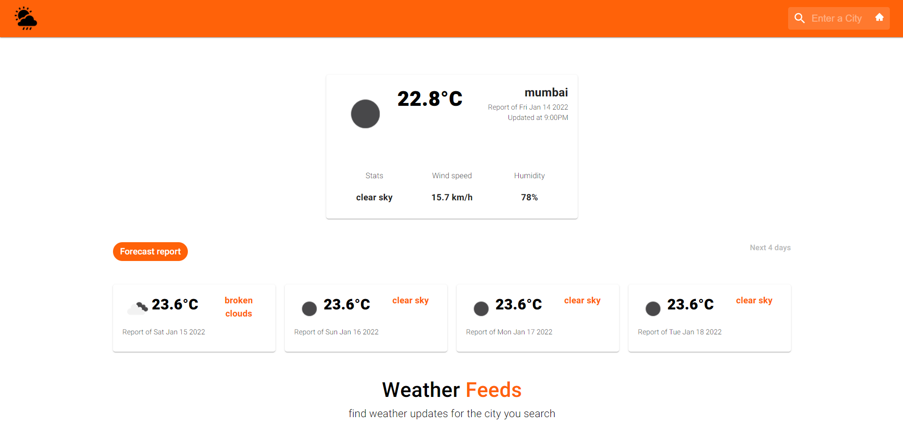
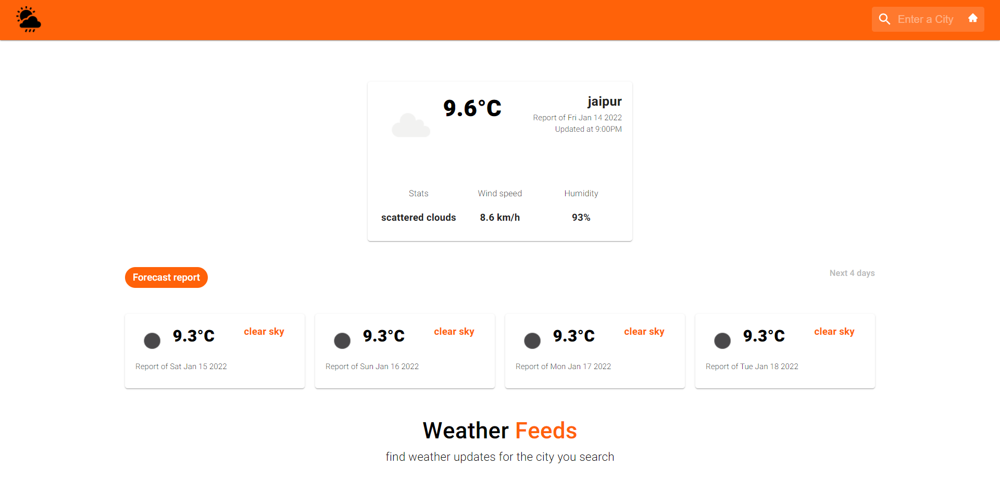
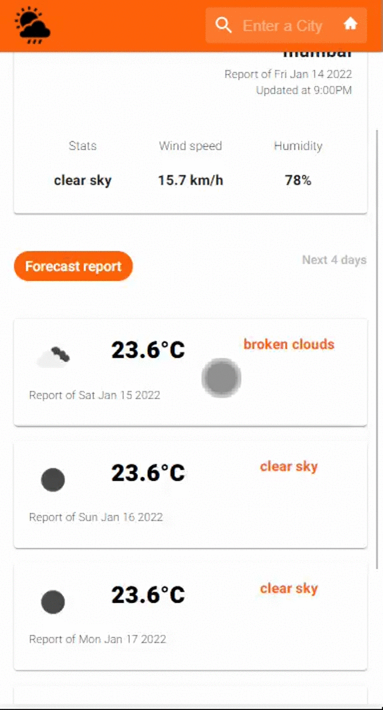

# WeatherFeeds

Webapp build using Reactjs and material ui (mui) and openweathermap api  
A very convenient and user friendly webapp.
Search your favourite city and get to know the current weather condition, temperature, windspeed, Humidity and much more

Also get a 4 day weather forecast for the city you search

### App homepage 

### Get to know the current weather and much more details of any city you search

### Mobile responsive

  

